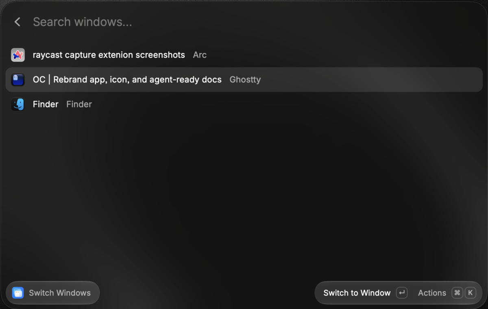
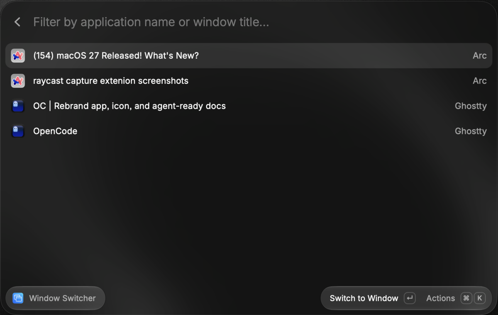

# Window Switcher

A Raycast extension for finding and switching to individual macOS windows, including windows on other Spaces and fullscreen windows.

## Why use it?

Raycast's built-in **Switch Windows** can miss windows on other Spaces. I've had the same problem people have raised on r/raycastapp: [switching between windows of one app](https://www.reddit.com/r/raycastapp/comments/1i4q0nf/is_there_any_to_switch_between_different_window/) and [getting to a specific Chrome window on another desktop](https://www.reddit.com/r/raycastapp/comments/1aoyfp5/actionhotkey_for_switching_between_windows_of_the/). Window Switcher finds those windows so you can search by title and go straight to one.

For example, with two Arc windows open, Raycast lists one; Window Switcher lists both:

| Raycast's Switch Windows                                                         | Window Switcher                                                                     |
| -------------------------------------------------------------------------------- | ----------------------------------------------------------------------------------- |
|  |  |

## What it does

- Search individual windows by title or app name, including windows on other Spaces.
- Switch directly to a selected window, including fullscreen windows.
- Close, minimize, restore, enter or exit fullscreen, or hide and show an app from the action menu.
- Choose independently whether to include minimized windows and windows owned by hidden apps. By default, minimized windows are excluded and windows of hidden apps are included.

## Install

You need macOS, Raycast, Node.js, and a Swift toolchain. Grant Raycast Accessibility permission when prompted so the extension can read and control windows.

```bash
git clone https://github.com/devadathanmb/raycast-window-switcher.git
cd raycast-window-switcher
npm install
npm run build
```

In Raycast, run **Import Extension** and select the generated `dist` folder. Open **Window Switcher**, type a window title or app name, and press Return to switch. Open the action menu for the other window controls.

## How it works

The Raycast UI calls a Swift helper that combines macOS Accessibility with window and Space information. Finding windows across Spaces depends on undocumented macOS APIs, so results may change with macOS updates. [WORKING.md](./WORKING.md) covers the discovery process and its limits. The cross-Space enumeration approach draws on [AltTab](https://github.com/lwouis/alt-tab-macos).

## Develop

```bash
npm run dev          # Rebuild the Swift helper and start Raycast development mode
npm run build        # Rebuild the helper and extension
npm run typecheck
npm run lint
```

The UI is in `src/window-switcher.tsx`; discovery and window actions are in `win-ninja/Sources/WinNinja/main.swift`. Use `npm run build:swift` to rebuild the helper alone.

## License

[GPL-3.0-only](./LICENSE)
